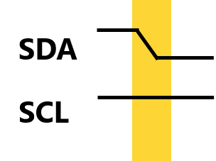
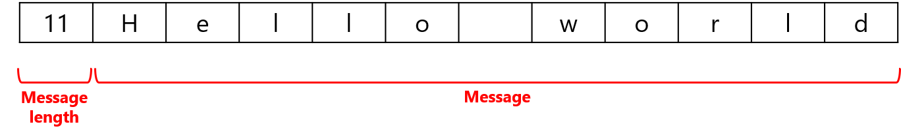
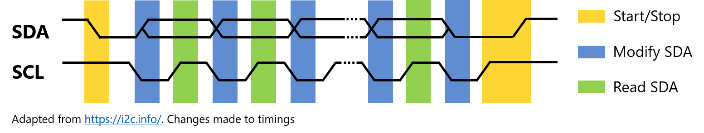
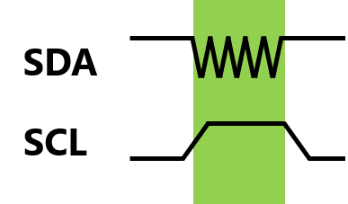

# SICC
The Synchronous Integrated Circuit Communication (SICC) Protocol is a half-duplex 2-wire serial communication protocol. It was based off the [I2C Serial Protocol](https://i2c.info/) with modifications made to the packet structure and addresses. 

Developed for Arduino, but compatible with other architectures by changing `delayMicroseconds()`, `micros()`, `pinMode()`, `digitalWrite()` and `digitalRead()` functions accordingly.

# Table of Contents
- [Contributors](#contributors)
- [Key Differences with I2C](#key-differences-with-i2c)
- [Protocol](#protocol)
	- [Hardware Setup](#hardware-setup)
	- [Overview of Protocol](#overview-of-protocol)
	- [Start Condition](#start-condition)
	- [Data Packet](#data-packet)
	- [Restarting](#restarting)
	- [Timeouts](#timeouts)

For **API**, refer to **[api.md](docs/api.md)** 
For **examples**, refer to **[examples.md](docs/examples.md)**

## Contributors
Name | Role
--- | ---
Jonathan Loh | Main Developer
River Koh | Testing and QC

## Key Differences with I2C
- Synchronous (Blocking)
- Does not use addresses (Only sends to 1 block)
- Only for 2 ICs
- Packet contains data length at start
- No stop signal
- Different restart signal

## Protocol
### Hardware Setup
All inputs will be pulled up using the internal pullup resistor. Inputs default to HIGH (1). Connecting the pin to GND or LOW (equivalent to connecting to GND) would cause the input to be LOW (0). The 2 wires will be referred to as SCL (serial clock) and SDA (serial data).

### Overview of Protocol
Every data transmission begins with a start condition, this will be covered later. The transmitter will then alternate SCL between HIGH and LOW. This will regulate when to send and read data from SDA.

### Start Condition
SCL is HIGH and SDA is pulled LOW

### Data Packet
Each data packet begins with the data length, followed by the data.

Each byte of data is sent in 8 bits, with a 9th bit sent as acknowledgement (ACK). When SCL is LOW, the transmitter will change the bit according to the byte to be sent. When SCL is HIGH, the receiver will read the bit. 

For the 9th bit, the transmitter will allow the SDA to float HIGH and sets the SCL to HIGH. During this period, the receiver will pull the SDA LOW, signalling an ACK. If no acknowledgement (NACK) is received by the transmitter, a restart is conducted. Each bit is also given a fixed timeout to be received. If the bit is not received, a restart is conducted by not sending an ACK.

### Restarting
If a restart is called by the transmitter due to NACK, the next time the SCL is HIGH (a bit is to be sent), the transmitter will oscillate SDA 10 times. If the receiver detects more than 3 oscillations (the number 3 was chosen to cater for rising and falling edge errors), the receiver restarts the receiving function after SCL is pulled LOW again. Since the transmitter initiated the restart, it resets the send function after setting SCL LOW.

### Timeouts
An overall timeout is given to the entire message transmission. The transmission is terminated if the message is not sent or received within the timeout and the process is stuck in a while-loop or a restart is called. 
